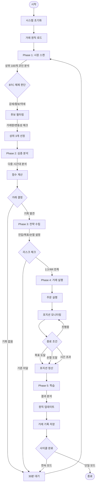

# OMNI Trading System

> **완전 자동화된 AI 기반 암호화폐 트레이딩 시스템**  
> GPT-5를 활용한 적응형 학습 기반 업비트(Upbit) 자동매매 봇

## 개요

OMNI Trading System은 최신 GPT-5 모델의 추론 능력과 기술적 분석을 결합한 완전 자동화 암호화폐 거래 시스템입니다. 5단계 파이프라인을 통해 시장을 분석하고, 최적의 거래 기회를 포착하며, 매 거래마다 학습하여 지속적으로 진화합니다.

### 핵심 기능

- **AI 기반 의사결정** - GPT-5 기반 시장 분석 및 전략 수립
- **적응형 학습** - 매 거래 후 즉시 원칙 업데이트를 통한 전략 개선
- **다중 시간대 분석** - 5분봉부터 일봉까지 다중 시간대 분석
- **리스크 관리** - 자동 손절/익절 및 포지션 사이징
- **장애 복구** - 프로그램 재시작 시 거래 자동 복구
- **실시간 대시보드** - Streamlit 기반 실시간 모니터링

## 기술 스택

### Core
- **Python 3.9+** - 핵심 프로그래밍 언어
- **OpenAI GPT-5** - AI 추론 엔진
- **SQLite3** - 거래 내역 로컬 데이터베이스
- **Asyncio** - 비동기 처리

### 거래 및 시장 데이터
- **Upbit API** - 한국 거래소 연동
- **pandas** - 시계열 데이터 처리
- **numpy** - 수치 계산
- **PyJWT** - API 인증

### 기술적 분석
- **TA-Lib** - 기술 지표
  - 이동평균선 (SMA, EMA, WMA)
  - 오실레이터 (RSI, MACD, Stochastic)
  - 변동성 (Bollinger Bands, ATR)
  - 거래량 (OBV, Volume Profile)
- **scipy** - 통계 분석

### 모니터링 및 시각화
- **Streamlit** - 실시간 웹 대시보드
- **Plotly** - 인터랙티브 차트
- **matplotlib** - 정적 시각화

## 빠른 시작

### 사전 요구사항

- Python 3.9 이상
- Upbit 계정 및 API 액세스
- OpenAI API 키

### 설치

1. **저장소 클론**
```bash
git clone https://github.com/yourusername/omni-trading-system.git
cd omni-trading-system
```

2. **가상환경 생성**
```bash
python -m venv venv
source venv/bin/activate  # Windows: venv\Scripts\activate
```

3. **의존성 설치**
```bash
pip install -r requirements.txt
```

4. **환경 변수 설정**
```bash
cp .env.example .env
# .env 파일을 열어 API 키 입력
```

`.env` 파일 구조:
```env
# Upbit API
UPBIT_ACCESS_KEY=your_access_key
UPBIT_SECRET_KEY=your_secret_key

# OpenAI API
OPENAI_API_KEY=your_openai_api_key

# 거래 설정
POSITION_SIZE_KRW=500000
MAX_POSITIONS=1
```

5. **시스템 초기화**
```bash
# 시스템 상태 확인
python check.py

# 트레이딩 시스템 실행
python main.py
```

## 프로젝트 구조

```
omni_trading_system/
├── main.py                 # 메인 실행 파일
├── check.py               # 시스템 검증 파일
├── requirements.txt       # 의존성 파일
├── .env                   # 환경 변수 파일
├── config/
│   └── settings.py        # 설정 관리
├── core/                  # 핵심 거래 로직
│   ├── market_analyzer.py # Phase 1: 시장 스캔
│   ├── deep_analyzer.py   # Phase 2: 심층 분석
│   ├── strategy_maker.py  # Phase 3: 전략 수립
│   ├── trade_executor.py  # Phase 4: 거래 실행
│   └── reflector.py       # Phase 5: 학습 시스템
├── data/                  # 데이터 처리
│   ├── upbit_client.py    # 거래소 API 클라이언트
│   ├── indicators.py      # 기술 지표
│   └── database.py        # 데이터베이스 관리
├── ai/                    # AI 통합
│   └── gpt_client.py      # OpenAI GPT 클라이언트
├── memory/                # 학습 저장소
│   └── Principles.md      # 동적 거래 원칙
├── logs/                  # 거래 기록
│   └── trade_history.db   # SQLite 데이터베이스
└── dashboard/             # 모니터링
    └── streamlit_app.py   # 웹 대시보드
```

## 시스템 아키텍처

### 5단계 거래 파이프라인

```
Phase 1 (시장 스캔) → Phase 2 (심층 분석) → Phase 3 (전략) → Phase 4 (실행) → Phase 5 (학습)
     ↑                                                                                    ↓
     ←────────────────────────────────────────────────────────────────────────────────←
```

### 상세 시스템 순서도



### OODA 루프 기반 의사결정 프레임워크

OMNI Trading System은 군사 전략에서 유래한 OODA(Observe-Orient-Decide-Act) 루프를 거래에 적용하여, 빠르고 적응적인 의사결정을 구현합니다.

```
┌─────────────────────────────────────────────────────────────┐
│                         OODA LOOP                           │
├─────────────────────────────────────────────────────────────┤
│                                                             │
│    ┌──────────┐      ┌──────────┐      ┌──────────┐      │
│    │ OBSERVE  │ ───> │  ORIENT  │ ───> │  DECIDE  │      │
│    └──────────┘      └──────────┘      └──────────┘      │
│         ↑                                     │            │
│         │                                     ↓            │
│    ┌──────────┐                         ┌──────────┐      │
│    │   ACT    │ <─────────────────────  │  DECIDE  │      │
│    └──────────┘                         └──────────┘      │
│         │                                                  │
│         └───────────── FEEDBACK LOOP ──────────┘          │
│                                                             │
└─────────────────────────────────────────────────────────────┘
```

#### **Observe (관찰)** - Phase 1: Market Analysis
- **실시간 데이터 수집**: 업비트 상위 100개 암호화폐의 가격, 거래량, 변동성 데이터
- **기술 지표 계산**: RSI, MACD, 볼린저 밴드, 이동평균선 등
- **시장 체제 파악**: BTC 시장 상태(강세/약세/횡보) 판단
- **패턴 인식**: 차트 패턴, 지지/저항 레벨 식별

#### **Orient (지향)** - Phase 2: Deep Analysis  
- **맥락 이해**: 현재 시장 상황을 과거 학습 데이터와 비교
- **원칙 적용**: memory/Principles.md의 누적 거래 지혜 활용
- **편향 제거**: GPT-5를 통한 객관적 분석으로 감정적 편향 배제
- **우선순위 설정**: 에너지 응축도, 상승 잠재력, 리스크 명확성 기반 평가

#### **Decide (결정)** - Phase 3: Strategy Making
- **진입 전략**: 정확한 진입가격과 타이밍 결정
- **목표 설정**: 기술적 저항선과 모멘텀 기반 목표가 설정
- **리스크 관리**: 손절가 설정 (최소 1:3 Risk:Reward)
- **포지션 크기**: 시장 상황에 따른 적응형 포지션 사이징

#### **Act (행동)** - Phase 4: Trade Execution
- **자동 주문 실행**: 계산된 파라미터로 즉시 주문
- **실시간 모니터링**: 5초마다 포지션 상태 체크
- **동적 대응**: 시장 변화에 따른 전략 조정
- **청산 실행**: 목표/손절/시간 기반 자동 청산

#### **Feedback Loop (피드백)** - Phase 5: Reflection
- **성과 분석**: 거래 결과 즉시 분석
- **원칙 진화**: 성공/실패 요인을 Principles.md에 반영
- **지속적 개선**: 다음 사이클에 학습 내용 적용
- **적응형 전략**: 시장 변화에 따른 자동 전략 조정

### OODA 루프의 장점

1. **속도**: 경쟁자보다 빠른 의사결정 사이클
2. **적응성**: 시장 변화에 실시간 대응
3. **학습**: 매 사이클마다 지속적 개선
4. **자동화**: 인간의 감정과 피로 없는 24/7 작동
5. **일관성**: 원칙 기반의 체계적 접근

### Phase 1: 시장 분석 (Market Analysis)
- 업비트 상위 100개 암호화폐 스캔
- BTC 시장 체제 분석 (BULL/BEAR/SIDEWAYS)
- 최고 잠재력 상위 3개 후보 식별
- 거래량, 변동성, 패턴 인식 기반 필터링
- **GPT-5 설정**: 추론 `medium`, 출력 `low` (빠른 스캔)

### Phase 2: 심층 분석 (Deep Analysis)  
- 후보에 대한 다차원 분석 수행
- 평가 항목: 에너지 응축, 잠재 상승폭, 리스크 명확성, 타이밍
- 단일 최적 기회 선택 또는 대기
- 이전 거래에서 학습한 원칙 적용
- **GPT-5 설정**: 추론 `high`, 출력 `low` (깊은 분석)

### Phase 3: 전략 수립 (Strategy Making)
- 정확한 진입가, 목표가, 손절가 수립
- MPM (Most Probable Move) 전략 구현
- 최소 1:3 Risk:Reward 비율 보장
- 시장 상황에 따른 포지션 크기 조정
- **GPT-5 설정**: 추론 `high`, 출력 `medium` (정밀 전략)

### Phase 4: 거래 실행 (Trade Execution)
- 자동 손절/익절과 함께 지정가 주문
- 5초마다 포지션 모니터링
- 3가지 청산 시나리오: 목표 도달, 손절, 시간 기반
- 시스템 재시작 시 거래 복구 지원

### Phase 5: 학습 및 진화 (Learning & Evolution)
- 거래 완료 즉시 결과 분석
- 결과에 기반한 거래 원칙 업데이트
- 누적 통계 유지
- 수동 개입 불필요
- **GPT-5 설정**: 추론 `high`, 출력 `medium` (원칙 생성)

## 사용법

### 실행 모드

**연속 거래 모드 (기본)**
```bash
python main.py
```
- 24/7 자동 사이클 관리로 실행
- 사이클 간 최소 30분 간격
- 재시작 시 자동 거래 복구

**단일 사이클 모드**
```bash
python main.py --once
```
- 한 번의 완전한 거래 사이클 실행
- 테스트 및 디버깅에 유용

**시스템 체크**
```bash
python check.py
```
- API 연결 확인
- 계정 잔액 확인
- 시스템 구성 검증

### 모니터링 대시보드

```bash
streamlit run dashboard/streamlit_app.py
```

접속 주소: `http://localhost:8501`

기능:
- 실시간 손익 추적
- 거래 내역 시각화
- 시장 상태 인디케이터
- 원칙 진화 추적
- 시스템 상태 메트릭

## 설정

### 거래 파라미터 (config/settings.py)

```python
# 포지션 관리
POSITION_SIZE_KRW = 500000  # 기본 포지션 크기
MAX_POSITIONS = 1            # 단일 포지션만

# 리스크 관리
STOP_LOSS_PERCENT = 2.0      # 거래당 최대 손실
MIN_RISK_REWARD_RATIO = 3.0  # 최소 R:R 비율

# 타이밍
MIN_CYCLE_INTERVAL_MINUTES = 30
MAX_HOLDING_HOURS = 48

# 시장 필터
MIN_VOLUME_RATIO = 0.5      # 평균 대비 최소 거래량
MAX_VOLATILITY_PERCENT = 10  # 일일 최대 변동성
```

### 적응형 포지션 크기 조정

시장 상황에 따른 자동 포지션 크기 조정:
- **강세장**: 기본 크기의 100%
- **횡보장**: 기본 크기의 60%  
- **약세장**: 기본 크기의 30%

### 리스크 관리 기능
- 한 번에 단일 포지션
- 자동 손절 주문
- 시간 기반 포지션 종료
- 과열 시장 필터
- BTC 상관관계 필터
- 물타기 금지
- 수동 개입 금지
- 부분 익절 금지

## 개발

### 테스트
```bash
# 단위 테스트 실행
pytest tests/

# 코드 품질 확인
pylint core/
mypy core/
```

### 디버깅
```bash
# .env에서 디버그 모드 활성화
DEBUG_MODE=True
LOG_LEVEL=DEBUG
```

### 기여 방법
1. 저장소 포크
2. 기능 브랜치 생성 (`git checkout -b feature/amazing-feature`)
3. 변경사항 커밋 (`git commit -m 'Add amazing feature'`)
4. 브랜치에 푸시 (`git push origin feature/amazing-feature`)
5. Pull Request 생성

## 요구사항

### 시스템 요구사항
- **OS**: Ubuntu 20.04+ / Windows 10+ / macOS
- **CPU**: 2코어 이상
- **RAM**: 최소 4GB, 권장 8GB
- **저장소**: 과거 데이터용 10GB
- **네트워크**: 안정적인 광대역 연결

### API 요구사항
- **OpenAI**: Tier 3+ (500 RPM)
- **Upbit**: API 거래 활성화된 인증 계정
- **Rate Limits**: 
  - OpenAI: 분당 500 요청
  - Upbit: 분당 1800 요청

## 중요 사항

### 보안
- `.env` 파일을 절대 버전 관리에 커밋하지 마세요
- 테스트용으로는 읽기 전용 API 키 사용
- 거래소 계정에 2FA 활성화
- API 사용량과 비용 모니터링

### 면책 조항
- **높은 위험**: 암호화폐 거래는 상당한 위험을 수반합니다
- **보장 없음**: 과거 성과가 미래 결과를 보장하지 않습니다
- **본인 책임**: 모든 거래 결정과 손실은 본인의 책임입니다
- **먼저 테스트**: 확대하기 전에 항상 소액으로 테스트하세요

---

<div align="center">
  <b>OMNI Trading System</b><br>
  <i>Powered by 운영자</i><br><br>
</div>
