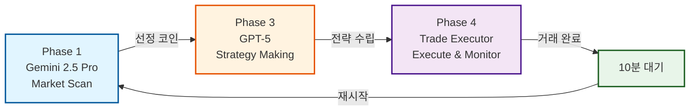
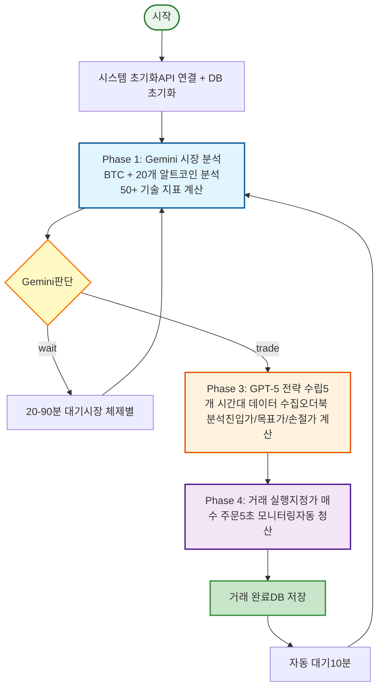

# OMNI Trading System

> **AI 기반 완전 자동화 암호화폐 트레이딩 시스템**  
> Gemini 2.5 Pro + GPT-5를 활용한 3-Phase 적응형 학습 업비트(Upbit) 자동매매 봇

---

## 운영 현황 (보존용 기록)

> **이 시스템은 더 이상 운영되지 않는다.** 아래는 당시의 운영 방식을 남긴 기록이고,
> 대시보드 주소와 성과 시트 링크는 개인 재무 정보가 담겨 있어 공개본에서 제거했다.

당시 Streamlit 대시보드로 확인하던 것:
- 실시간 거래 상태 — 현재 포지션, 수익률, 진행 중인 전략
- 거래 내역 — 최근 이력, 매매 타이밍, 손익 차트
- 누적 수익 — 전체 통계, 승률, 평균 수익률
- AI 분석 현황 — 어떤 코인을 어떤 전략으로 분석 중인지
- 시스템 상태 — 잔고, 마지막 업데이트 시각

운영비(GCP VM·API 사용료·디스크)와 거래 성과는 별도 시트로 관리했다.

## 개요

**OMNI Trading System**은 최신 AI 기술을 활용한 완전 자동화 암호화폐 트레이딩 시스템입니다. **Gemini 2.5 Pro**의 대규모 데이터 분석 능력과 **GPT-5**의 정교한 전략 수립 능력을 결합하여, 24시간 데이터 기반 의사결정으로 시장을 분석하고 최적의 거래 기회를 포착합니다.

### 핵심 특징

- **듀얼 AI 엔진** - Gemini 2.5 Pro (시장 분석) + GPT-5 (전략 수립)
- **다중 시간대 분석** - 5분봉부터 일봉까지 5개 시간대 동시 분석
- **오더북 기반 미세 조정** - 실시간 호가창 분석으로 정밀한 진입/청산
- **리스크 관리** - 자동 손절/익절, 적응형 포지션 사이징 (25-90%)
- **장애 복구** - 시스템 재시작 시 거래 자동 복구
- **실시간 대시보드** - Streamlit 기반 모니터링 및 시각화
- **빠른 사이클** - 거래 완료 후 10분 대기로 신속한 재진입

---

## 기술 스택

### Core AI & Processing
- **Python 3.9+** - 핵심 프로그래밍 언어
- **Google Gemini 2.5 Pro** - Phase 1 시장 분석 AI
- **OpenAI GPT-5** - Phase 3 전략 수립 AI
- **SQLite3** - 거래 기록 저장소

### 거래 & 시장 데이터
- **Upbit API** - 한국 거래소 연동
- **pandas** - 시계열 데이터 처리
- **numpy** - 수치 계산

### 기술적 분석 (50+ Indicators)

**추세 지표**
- 이동평균선: SMA (5, 10, 20, 50, 100, 200일), EMA (12, 26일), WMA (20일)
- ADX (14일), Parabolic SAR

**모멘텀 지표**
- RSI (14일), MACD (12, 26, 9일), Stochastic (%K, %D)
- CCI (20일), Williams %R (14일), ROC (12일)

**변동성 지표**
- Bollinger Bands (20일, ±2σ)
- ATR (14일) - 5개 시간대별
- Keltner Channels

**거래량 지표**
- OBV (On-Balance Volume)
- Volume Ratio
- VWAP (Volume Weighted Average Price)

**핵심 레벨**
- Pivot Points (R1, R2, S1, S2)
- Recent High/Low (20봉 기준)
- Price Position (0-100%)
- Divergence Detection (RSI/MACD)

### 모니터링 & 시각화
- **Streamlit** - 실시간 웹 대시보드
- **Plotly** - 인터랙티브 차트

---

## 시스템 아키텍처

### 3-Phase 거래 파이프라인



**Phase 1 (Gemini)**: 20개 코인 병렬 분석 → 1개 선정  
**Phase 3 (GPT-5)**: 데이터 수집 + 전략 수립 (진입가/목표가/손절가/포지션)  
**Phase 4 (Executor)**: 지정가 주문 → 5초 모니터링 → 자동 청산

### 상세 동작 순서도



---

## Phase별 상세 동작 원리

### Phase 1: Gemini 2.5 Pro - 시장 스캔 & 후보 선정

**목표**: 상위 20개 코인을 분석하여 단 1개의 최고 기회를 AI가 자율 선정

**동작 단계**:
1. BTC 시장 체제 분석 (5개 시간대)
   - 시장 체제 판단: BULL / SIDEWAYS / BEAR
   - RSI, MACD, ADX 등 종합 분석

2. 상위 20개 알트코인 병렬 스캔
   - 각 코인별 5개 시간대 데이터 수집
   - 50+ 기술 지표 계산
   - 거래량, 모멘텀, 변동성 분석

3. Gemini AI 자율 판단
   - 순수 데이터 기반 의사결정
   - action: "trade" 또는 "wait"
   - 선정 시: 코인명, 신뢰도(%), 예상 움직임 제공

---

### Phase 3: GPT-5 - 전략 수립 (데이터 수집 포함)

**목표**: Phase 1에서 선정된 코인의 완전한 데이터 수집 + 정확한 전략 수립

**동작 단계**:

1. **선정 코인 심층 데이터 수집**
   - 5개 시간대 상세 분석 (5분, 15분, 1시간, 4시간, 일봉)
   - 각 시간대별 50+ 지표 계산
   - 핵심 레벨 식별 (High/Low, Pivot, VWAP)
   - 오더북 실시간 분석 (스프레드, 매수/매도 압력, 호가벽 감지)
   - ATR 변동성 분석

2. **GPT-5 전략 생성**
   
   **STEP A: 시장 체제별 베이스 전략 선택**
   
   | 시장 체제 | 진입 규칙 | 목표가 | 손절가 | 기본 포지션 | R:R |
   |---------|---------|--------|--------|-----------|-----|
   | BULL_TREND | -0.3% 풀백 대기 | +3.5% 또는 +1.5 ATR | -2.5% 또는 -1.0 ATR | 65% | 1.3 |
   | SIDEWAYS | -0.5% 풀백 대기 | +2.5% 또는 +1.0 ATR | -3.0% 또는 -1.2 ATR | 45% | 1.2 |
   | BEAR_TRAP | -0.7% 풀백 대기 | +1.8% 또는 +0.7 ATR | -2.0% 또는 -0.7 ATR | 25% | 1.0 |
   | KOREAN_PUMP | 즉시 시장가 진입 | +5.0% 또는 +2.0 ATR | -3.5% 또는 -1.5 ATR | 55% | 1.5 |
   
   **STEP B: 오더북 미세 조정**
   - 매수/매도 압력에 따른 진입가 조정
   - 호가벽 감지 시 목표가/손절가 보정
   
   **STEP C: 최종 포지션 크기 계산**
   - 신뢰도, 변동성, 오더북 압력 종합
   - 최종 범위: 25-90%

3. **리스크 검증**
   - R:R ≥ 1.0 확인
   - 포지션 크기 제한 확인

**출력**: 진입가, 목표가, 손절가, 포지션 크기, 전략 근거

---

### Phase 4: 거래 실행 & 모니터링

**목표**: 계산된 전략으로 실제 거래 실행 및 완료까지 모니터링

**동작 단계**:

1. **매수 주문 실행**
   - 지정가 주문 (entry_price)
   - 최대 1시간 대기

2. **실시간 모니터링** (5초 간격)
   - 현재가 체크
   - 목표가 도달 → 즉시 청산
   - 손절가 도달 → 즉시 청산
   - 48시간 초과 → 강제 청산

3. **매도 주문 실행**
   - 시장가 즉시 청산
   - 거래 결과 DB 저장

4. **사이클 완료 & 대기**
   - 10분 대기
   - Phase 1로 재시작

---

## 빠른 시작

### 사전 요구사항

- Python 3.9 이상
- Upbit 계정 및 API 액세스
- OpenAI API 키
- Google Gemini API 키

### 설치

```bash
# 1. 저장소 클론
git clone https://github.com/yourusername/omni-trading-system.git
cd omni-trading-system

# 2. 가상환경 생성
python -m venv venv
source venv/bin/activate  # Windows: venv\Scripts\activate

# 3. 의존성 설치
pip install -r requirements.txt

# 4. 실행
python main.py
```

### 환경 변수

```env
# Upbit API
UPBIT_ACCESS_KEY=your_access_key
UPBIT_SECRET_KEY=your_secret_key

# AI APIs
OPENAI_API_KEY=your_openai_api_key
GEMINI_API_KEY=your_gemini_api_key

```

---

## 실행 모드

### 연속 거래 모드 (기본)
```bash
python main.py
```
- 24/7 무한 사이클 실행
- 거래 완료 후 자동 대기 (10분)
- Ctrl+C로 안전 종료

### 단일 사이클 모드
```bash
python main.py --once
```
- 1회만 실행 후 종료
- 테스트 및 디버깅용

---

## 모니터링 대시보드

```bash
streamlit run dashboard/streamlit_app.py
```

접속: `http://localhost:8501`

**기능**:
- 실시간 손익 추적
- 거래 내역 차트
- 현재 포지션 상태
- 시스템 상태 모니터링

---

## 주요 설정

### 거래 파라미터 (config/settings.py)

```python
# AI 모델
GPT_MODEL = 'gpt-5'
GEMINI_MODEL = 'gemini-2.5-pro'

# 포지션 관리
MIN_POSITION_SIZE_PERCENT = 25  # 최소 25%
MAX_POSITION_SIZE_PERCENT = 90  # 최대 90%
```

---

## 시스템 요구사항

### 최소 사양 (GCP 기준)
```
OS: Ubuntu 22.04 LTS
CPU: 2 vCPU (e2-small)
RAM: 2GB
저장소: 20GB Standard Persistent Disk
네트워크: 고정 외부 IP, 안정적인 연결
```

### 권장 사양
```
머신 유형: e2-small 이상
리전: asia-northeast3 (Seoul) - 업비트 API 응답 속도 최적화
디스크: Standard 20GB
```

### 예상 운영 비용 (GCP)
| 항목 | 사양 | 월 예상 비용 (USD) |
|------|------|-------------------|
| Compute Engine | e2-small VM | $15.69 |
| Persistent Disk | Standard 20GB | $1.04 |
| Networking | 고정 외부 IP | $3.65 |
| **합계** | | **약 $20.38/월** (약 ₩27,700) |

### API 요구사항
```
OpenAI API: API 키 발급 (카드 등록 필요)
Gemini API: API 키 발급 (무료 또는 유료)
Upbit API: 인증 완료, 거래 권한 활성화
```

---

## 프로젝트 구조

```
omni_trading_system/
│
├── main.py                  # 메인 실행 파일
├── requirements.txt         # 패키지 목록
├── .env                     # 환경 변수 (비공개)
├── README.md                # 이 문서
│
├── config/
│   └── settings.py          # 전역 설정
│
├── core/
│   ├── market_analyzer.py   # Phase 1: Gemini 시장 분석
│   ├── strategy_maker.py    # Phase 3: GPT-5 전략 수립
│   └── trade_executor.py    # Phase 4: 거래 실행
│
├── data/
│   ├── upbit_client.py      # 업비트 API
│   ├── indicators.py        # 기술 지표 (50+)
│   └── database.py          # SQLite DB
│
├── ai/
│   └── gpt_client.py        # GPT-5 + Gemini 클라이언트
│
├── logs/
│   └── trade_history.db     # 거래 기록
│
└── dashboard/
    └── streamlit_app.py     # 웹 대시보드
```

### 리스크 관리 체계

**적용된 안전장치**:
- 단일 포지션 (동시 1개만)
- 자동 손절 (모든 거래 필수)
- 포지션 제한 (25-90% 자동 조절)
- 변동성 필터 (EXTREME 시 포지션 축소)

**금지된 행위**:
- 물타기 (추가 매수 절대 금지)
- 수동 개입 (완전 자동 운영)
- 부분 익절 (목표가 도달 시 전량 청산)

---

## 라이선스

```
Restricted License

Copyright (c) 2025 OMNI Trading System. All Rights Reserved.

Permissions:
View source code for educational purposes
Study the implementation and algorithms

Restrictions:
Commercial use
Redistribution or sharing
Modification or derivative works
Using this software for actual trading without permission

This is a proprietary trading system. Unauthorized use may result in 
financial loss. The author assumes no liability for any damages.

For licensing inquiries, contact: [your-email@example.com]
```

---

<div align="center">


[맨 위로 돌아가기](#omni-trading-system)

</div>